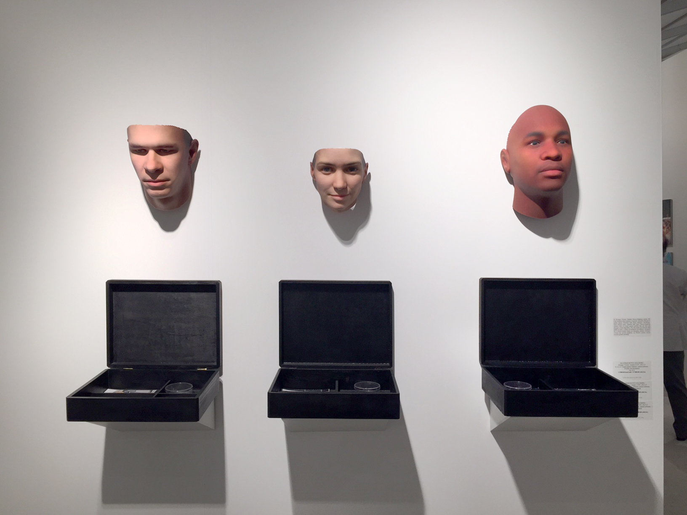

In 'Stranger Visions' the artist, Heather Dewey-Hagborg, collected personal traces like hair, cigarette butts, and chewing gum, that strangers unwittingly left behind in public spaces. The genetic material from these artifacts was extracted, and analyzed to construct computationally generated 3D printed portrait sculptures. 

These plastic facial reconstructions with their indistinct hollow gazes were displayed on a white wall much like animal trophy heads. A black box below the sculpture exhibited the refuse material from which the genetic material was retrieved, an image of where it was recovered from, and a brief description of the genetic details obtained.     

The bizarre trophy display of faces with deadpan eyes, and refuse material from the streets, made me recoil at first impression. As I explored the startling definition of facial characteristics in the sculptures, I was amazed by the rich potential for information contained in these nearly unavoidable biological 'footprints' of our existence. The fascination soon turned to alarm and vulnerability at the thought of how easily someone can pick up on my biological 'footprint'.

The artist doesn't simply present the message of the art, but lets the art drag the viewer through these rollercoaster responses and discover the theme by themselves. What seems to begin as an exploration of abstract genetic identity, and its startlingly mundane physical manifestation in our refuse, grows into a sign of caution on the fragility of genomic privacy, and a larger debate over the social and ethical implications of genomic data collection, its use, and potential biases.

Oddly, what appealed to me about this art was that it unsettled me at first glance. This first wave of disruption was later followed by an even stronger wave of trepidation at the fragility of genomic privacy, which amplified the efficacy of the art's communication. I also liked that the art wasn't product, but process-oriented. The final plastic masks by themselves communicate little, the story of how it was constructed adds depth and richness to the character of the art piece, and makes it strangely personal.

The slightly harsh effectiveness of the art though seems to come at a cost. The unsettling first impression may distance passing-by viewers. Instead of shocking at first sight, the art could be presented to pull in viewers by intriguing them, then unsettling them by exposing the background of the art.

This art with a cause reminds of a quote by prominent artist Banksy: 'Art should comfort the disturbed and disturb the comfortable'. 'Stranger Visions' is effective at disturbing the viewer, but I feel it could be improved by providing a constructive way to resolve the viewer's alarm.  
